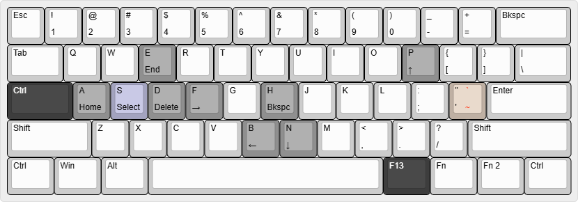

# ahk
My [AutoHotkey](https://www.autohotkey.com/) scripts.

## Keyboard utils

_From [keyboard-layout-editor.com](https://www.keyboard-layout-editor.com/)_

### Black keys
These have been remapped with [PowerToys](https://learn.microsoft.com/en-us/windows/powertoys/keyboard-manager).

| From       | To         |
|------------|------------|
|`CapsLock`  |`Ctrl`      |
|`RAlt`      |`F13`       |

### Gray keys
These let you navigate and edit text without moving your hands out of typing position. They activate when `F13` is held.

| From       | To         |
|------------|------------|
|`P`         |`↑`         |
|`N`         |`↓`         |
|`B`         |`←`         |
|`F`         |`→`         |
|`A`         |`Home`      |
|`E`         |`End`       |
|`D`         |`Delete`    |
|`H`         |`Backspace` |

### Orange keys
These are more convenient ways to type characters. They activate when `F13` is held, and they work with `Shift`.

For example on a 60% keyboard, where `Escape` replaces `Backtick` and `Tilde`, it's a lot easier to type `F13 + '` than `Fn + Esc`.

| From       | To         |
|------------|------------|
|`'`         |`Backtick`  |
|`Shift + '` |~           |

### Purple keys
These trigger custom commands.

#### Select
When `F13` is held, pressing `S` will start a selection.

The selection stays active while `F13` is held, so you can move the cursor without letting go to adjust the selection, and then let go when you're done.

Pressing `S` again without letting go of `F13` also ends the selection.

### Portuguese diacritics
Typing an accent followed by a valid letter will turn into a diacritic. It works for uppercase letters as well.

If you need to type the actual accent, pressing space after the accent will cancel this.

| From       | (or)       | To         | (or)       |
|------------|------------|------------|------------|
|`'a`        |`'A`        |á           |Á           |
|`^a`        |`^A`        |â           |Â           |
|`~a`        |`~A`        |ã           |Ã           |
|`Backtick a`|`Backtick A`|à           |À           |
|`'c`        |`'C`        |ç           |Ç           |
|`'e`        |`'E`        |é           |É           |
|`^e`        |`^E`        |ê           |Ê           |
|`'i`        |`'I`        |í           |Í           |
|`'o`        |`'O`        |ó           |Ó           |
|`^o`        |`^O`        |ô           |Ô           |
|`~o`        |`~O`        |õ           |Õ           |
|`'u`        |`'U`        |ú           |Ú           |

### Suspend
`F13 + F12` suspends the script until press `F13 + F12` again.
