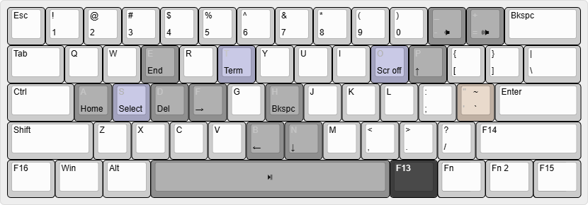

# ahk

My [AutoHotkey](https://www.autohotkey.com/) scripts.

## Keyboard utils

 
_My keyboard layout._

### Key colors

-  OS level remaps
-  Key remaps
-  Character remaps
-  Functions

### OS

 
_Remapped with [PowerToys](https://learn.microsoft.com/en-us/windows/powertoys/keyboard-manager) and always active._

Moves `Ctrl` to the home row and turns free keys into function keys.

| From       | To     |
| ---------- | ------ |
| `CapsLock` | `Ctrl` |
| `RAlt`     | `F13`  |
| `RShift`   | `F14`  |
| `RCtrl`    | `F15`  |
| `LCtrl`    | `F16`  |

### F13

 
_Active when F13 is held._

#### Navigating and editing

These let you navigate and edit text without moving your hands out of typing position.

| From | To          |
| ---- | ----------- |
| `P`  | `↑`         |
| `N`  | `↓`         |
| `B`  | `←`         |
| `F`  | `→`         |
| `A`  | `Home`      |
| `E`  | `End`       |
| `D`  | `Delete`    |
| `H`  | `Backspace` |

#### Typing

These are more convenient ways to type characters. They activate when `F13` is held, and they work with `Shift`.

For example on a 60% keyboard, where `Escape` replaces `Backtick` and `Tilde`, it's a lot easier to type `F13 + '` than `Fn + Esc`.

| From        | To         |
| ----------- | ---------- |
| `'`         | `Backtick` |
| `Shift + '` | ~          |

#### Media control

| From    | To                 |
| ------- | ------------------ |
| `=`     | `Volume_Up`        |
| `-`     | `Volume_Down`      |
| `Space` | `Media_Play_Pause` |

#### Select

When `F13` is held, pressing `S` will start a selection.

The selection stays active while `F13` is held, so you can move the cursor without letting go to adjust the selection, and then let go when you're done.

Pressing `S` again without letting go of `F13` also ends the selection.

| From | To       |
| ---- | -------- |
| `S`  | `Select` |

#### Screen off

Runs an executable that starts a black screensaver. Quick way to turn off OLED monitors.

| From | To           |
| ---- | ------------ |
| `O`  | `Screen off` |

### F14

 
_Active when F14 is held._

#### Numpad

These emulate a numpad for applications or games that need it.

| From    | To          |
| ------- | ----------- |
| `Space` | `Numpad0`   |
| `F13`   | `NumpadDot` |
| `,`     | `Numpad1`   |
| `.`     | `Numpad2`   |
| `/`     | `Numpad3`   |
| `l`     | `Numpad4`   |
| `;`     | `Numpad5`   |
| `'`     | `Numpad6`   |
| `o`     | `Numpad7`   |
| `p`     | `Numpad8`   |
| `[`     | `Numpad9`   |

### Portuguese diacritics

Typing an accent followed by a valid letter will turn into a diacritic. It works for uppercase letters as well.

If you need to type the actual accent, pressing space after the accent will cancel this.

| From         | (or)         | To  | (or) |
| ------------ | ------------ | --- | ---- |
| `'a`         | `'A`         | á   | Á    |
| `^a`         | `^A`         | â   | Â    |
| `~a`         | `~A`         | ã   | Ã    |
| `Backtick a` | `Backtick A` | à   | À    |
| `'c`         | `'C`         | ç   | Ç    |
| `'e`         | `'E`         | é   | É    |
| `^e`         | `^E`         | ê   | Ê    |
| `'i`         | `'I`         | í   | Í    |
| `'o`         | `'O`         | ó   | Ó    |
| `^o`         | `^O`         | ô   | Ô    |
| `~o`         | `~O`         | õ   | Õ    |
| `'u`         | `'U`         | ú   | Ú    |

### Suspend

`F13 + F12` suspends the script until press `F13 + F12` again.
